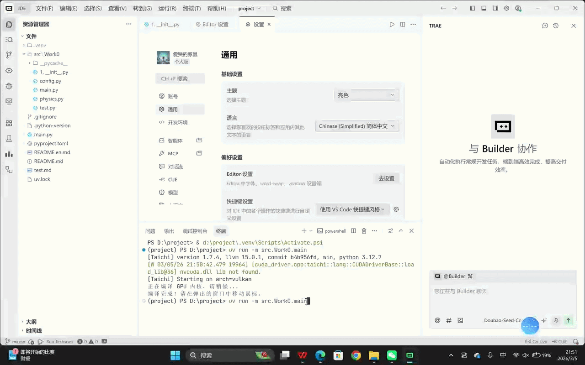

# work01

#### 介绍
实验1代码展示

# 万有引力粒子群仿真实验



## 📋 项目简介
本项目基于 **Taichi** 高性能并行计算框架，实现了一个**万有引力粒子群仿真系统**。通过GPU并行计算模拟了10000个粒子在鼠标引力作用下的运动效果，展示了粒子系统的物理交互与实时渲染。

## 🏗️ 项目架构
```bash
CG_Lab/
├── pyproject.toml          # 项目配置文件
├── README.md               # 项目说明文档
├── images/                 # 演示图片/GIF存放目录
│   └── demo.gif            # 运行效果演示
└── src/
    └── Work0/              # 实验零核心代码包
        ├── __init__.py     # 包标识文件
        ├── config.py       # 参数配置中心
        ├── physics.py      # GPU并行计算逻辑
        └── main.py         # 程序入口与GUI渲染
```

## 🚀 功能特性
- **GPU并行加速**：基于Taichi框架实现10000+粒子的实时物理计算
- **鼠标交互引力**：粒子群跟随鼠标位置产生动态引力效果
- **物理系统模拟**：
  - 万有引力计算
  - 空气阻力衰减
  - 边界弹性碰撞
- **参数化配置**：所有物理参数集中在`config.py`中，便于调试

## 💻 技术栈
- 编程语言：Python 3.12
- 核心框架：Taichi (GPU并行计算)
- 包管理工具：uv (现代Python包管理器)
- 版本控制：Git + Gitee

## ⚙️ 快速开始

### 环境配置
```bash
# 1. 安装 uv 包管理器
curl -LsSf https://astral.sh/uv/install.sh | sh

# 2. 克隆项目
git clone https://gitee.com/Admin0521/work01.git
cd work01

# 3. 运行项目
uv run -m src.Work0.main
